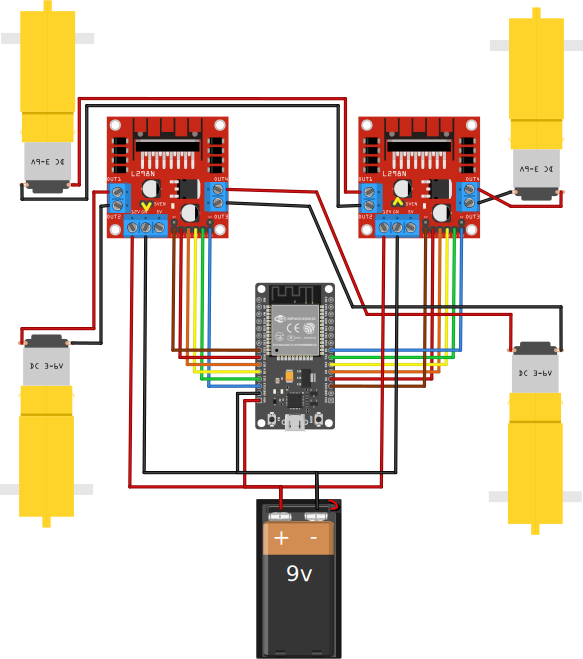
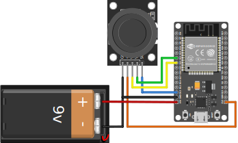
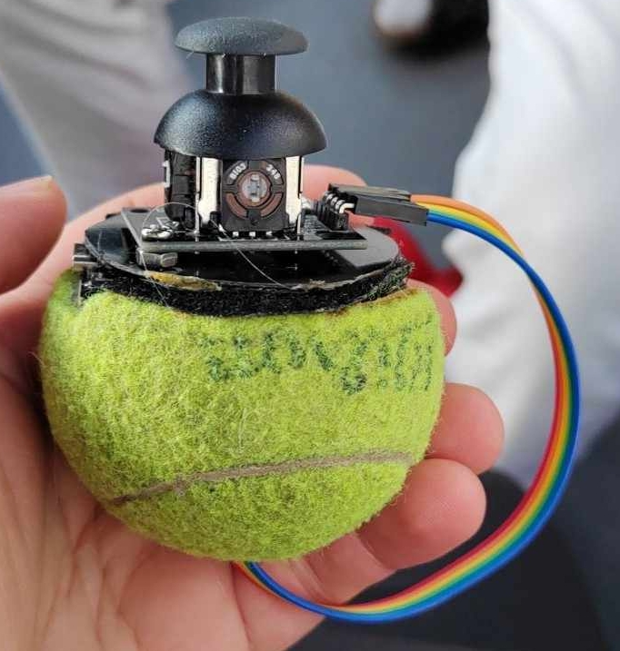
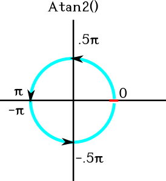
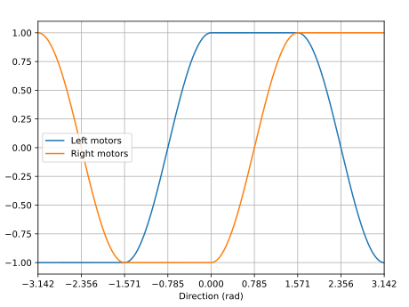

# ESP32 remote controlled toy car
This is a simple RC car library which uses Expressif's ESP-NOW for wireless control. Written in C++ using PlatformIO with the Arduino framework in VS Code.

## Bill of materials
 - 2 x ESP32 dev boards (Tested on HW-394 boards)
 - 1 x 5-pin joystick module
 - 2 x L298N H-bridge dual motor driver module
 - 4 x generic DC motor + wheels (Tested with d=65mm ones)
 - Chassis compatible with the motors
 - 2 x power source (USB power bank, 9v battery, etc.)
 - Jumper wires

## Physical build
### Car body
Fasten the motors to the chassis according to the manufacturer's instructions. Afterwards wire in the components as follows:



Make sure to bridge the 5VEN pins on the motor drivers (indicated by yellow wires).

### Remote controller
Connect the joystick to the ESP32.



You may want to build a chassis for the remote for ease of use. I suggest getting creative with it. 🙂




## Programming the ESPs
You will need your car ESP's MAC address for communication. The simplest way to check it is to upload the following program to it and opening a serial monitor on the appropriate terminal. Make sure to configure the monitor's baud rate to 115200.

```c++
#include <Arduino.h>
#include <WiFi.h>
void setup()
{
    Serial.begin(115200);
    WiFi.mode(WIFI_STA);
}
void loop()
{
    Serial.println(WiFi.macAddress());
}
```
Once you have the MAC address, head to `joyControl/src/main.cpp` and replace the byte hexes in `broadcastAddress[]` with those of your ESP's MAC address.

Using the PlatformIO extension in VS Code, build and upload `joyControl` to the remote controller's ESP, and `carBody` to the car ESP. On Linux, you must enable the connecting USB terminal:
```bash
sudo chmod a+rw /dev/ttyUSB0
```
Your ESP might be connected on a different terminal. Check if the PlatformIO extension can detect the port your ESP board is connected on. If none are found, try restarting your computer, and if it still does not show up, try a different USB cable.

## Operation
The remote controller reads the values of the joystick. This is comprised of the readings of two perpendicularly aligned potentiometers and that of a button (here used for braking). The values of the pots form a square, with additional dead space in the circumircle.

The remote controller converts these readings into polar notation, with the distance `r` from the joystick's center being calculated as the maximum of the two coordinates (Chebyshev distance), and the direction `theta` calculated using 2-argument arctangent, resulting in the following radian representation:



The car's microcontroller receives these values, and performs skid steering. The speed of the motors on each side is calculated by multiplying `r` by the following coefficient function based on `theta`:


